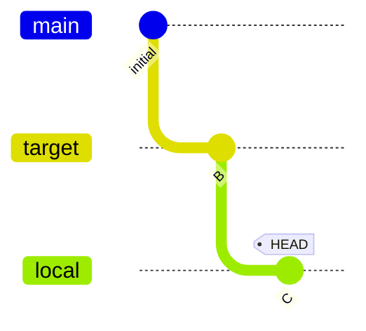
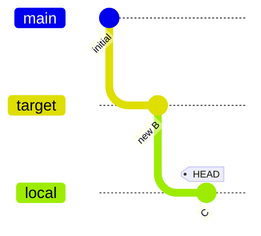
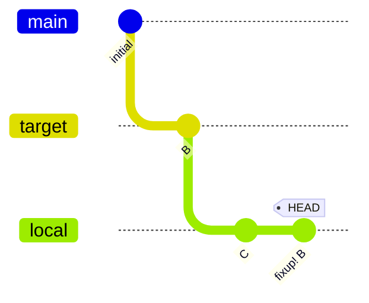

# amend/reword: targeting an ancestor branch

Verify that amending or rewording an ancestor commit correctly rebases
dependent branches. Also covers the conflict case where rebasing fails.

The setup creates main(A) -> target(B) -> local(C) with HEAD on local.

```scenario
SETUP
INIT
create target
write-file b.txt "b"
stage b.txt
git commit -m "B"
create local
write-file c.txt "c"
stage c.txt
git commit -m "C"
DONE
```

<details>
<summary>After SETUP</summary>



</details>

```scenario
IT "amend --message target rewords ancestor and rebases dependents"
amend --message "new B" target
EXPECT commit-message "C"
EXPECT on branch local
```

<details>
<summary>After "amend --message target rewords ancestor and rebases dependents"</summary>



</details>

```scenario
IT "amend ancestor with staged changes rebases dependents"
write-file b.txt "new b"
stage b.txt
amend target
EXPECT commit-message "C"
EXPECT on branch local
```

```scenario
IT "reword --message target rewords ancestor and rebases dependents"
reword --message "new B" target
EXPECT commit-message "C"
EXPECT on branch local
```

<details>
<summary>After "reword --message target rewords ancestor and rebases dependents"</summary>


</details>

```scenario
IT "amend ancestor with conflicting changes fails gracefully"
write-file c.txt "conflicted c"
stage c.txt
try amend target
EXPECT stderr contains "squash conflicts"
EXPECT commit-message "fixup! B"
```

<details>
<summary>After "amend ancestor with conflicting changes fails gracefully" (FAILED)</summary>



```console
$ exit code: 1
ERROR: Failed to re-stack branch `local`: squash conflicts:
  c.txt
; class=Index (10); code=Unmerged (-10)
note: to undo, run `git branch-stash pop git-stack`
```

</details>
