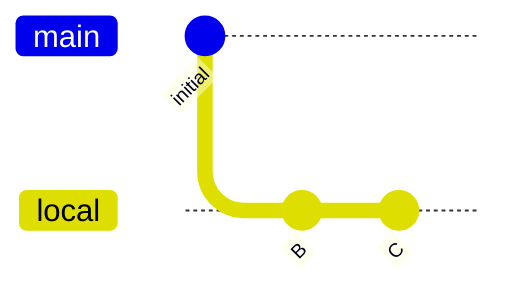

# amend: detached HEAD

Verify that amend works when HEAD is detached. The dependent branch
(local) should be rebased onto the amended commit.

The setup creates main(A) -> B -> C(local), then detaches HEAD at B.

```scenario
SETUP
INIT
create local
write-file b.txt "b"
stage b.txt
git commit -m "B"
write-file c.txt "c"
stage c.txt
git commit -m "C"
git checkout HEAD~1
DONE
```

<details>
<summary>After SETUP</summary>



</details>

```scenario
IT "amend succeeds on detached HEAD"
write-file b.txt "new b"
stage b.txt
amend
EXPECT stderr contains "Amended to"
```
