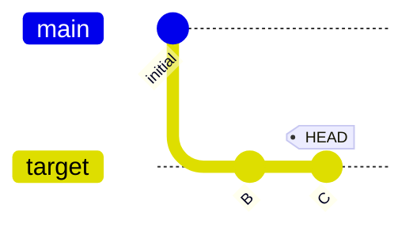
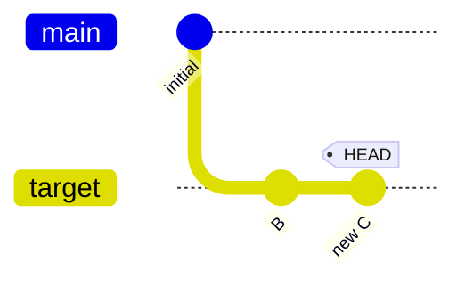
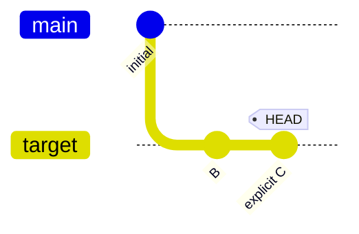

# amend: operations targeting HEAD

Verify the basic `amend` workflows: reword via `--message`, amend staged
changes, amend with `--all`, explicit HEAD target, and the noop case.

The setup creates main(A) -> target(B, C) with HEAD on target.

```scenario
SETUP
INIT
create target
write-file b.txt "b"
stage b.txt
git commit -m "B"
write-file c.txt "c"
stage c.txt
git commit -m "C"
DONE
```

<details>
<summary>After SETUP</summary>



</details>

```scenario
IT "amend with nothing staged is a noop"
try amend
EXPECT stderr contains "nothing to amend"
```

<details>
<summary>After "amend with nothing staged is a noop" (FAILED)</summary>


```console
$ exit code: 1
error: nothing to amend to 060f43c: C
```

</details>

```scenario
IT "amend --message rewords HEAD"
amend --message "new C"
EXPECT commit-message "new C"
EXPECT on branch target
```

<details>
<summary>After "amend --message rewords HEAD"</summary>



</details>

```scenario
IT "amend --all stages and amends"
write-file c.txt "new c"
amend --all
EXPECT stderr contains "Adding c.txt"
EXPECT on branch target
```

```scenario
IT "amend with staged changes"
write-file c.txt "new c"
stage c.txt
amend
EXPECT on branch target
```

```scenario
IT "amend with explicit HEAD target"
write-file c.txt "new c"
stage c.txt
amend HEAD
EXPECT on branch target
```

```scenario
IT "reword with explicit HEAD target"
reword --message "explicit C" HEAD
EXPECT commit-message "explicit C"
EXPECT on branch target
```

<details>
<summary>After "reword with explicit HEAD target"</summary>



</details>
