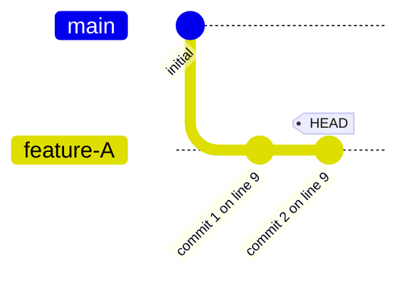
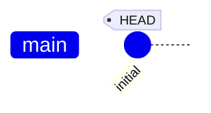
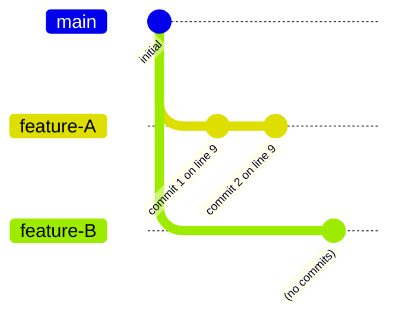

# branch lifecycle: create, verify, delete

Verify basic branch creation and deletion operations.

```scenario
SETUP
INIT
create feature-A
commit 2 times
DONE
```

<details>
<summary>After SETUP</summary>



</details>

```scenario
IT "creates a branch that exists"
EXPECT exists feature-A
EXPECT on branch feature-A
EXPECT clean
```

```scenario
IT "delete-branch removes the branch"
checkout main
delete-branch feature-A
EXPECT not-exists feature-A
EXPECT on branch main
```

<details>
<summary>After "delete-branch removes the branch"</summary>



</details>

```scenario
IT "create on parent switches correctly"
create feature-B on main
EXPECT on branch feature-B
EXPECT ancestor main feature-B
```

<details>
<summary>After "create on parent switches correctly"</summary>



</details>
