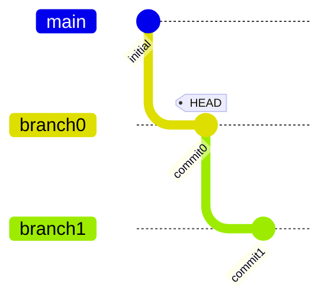
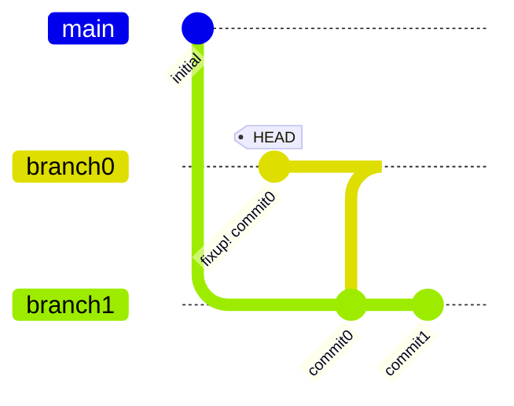

# bug #307: amend --message loses commit message when fixups exist

Reproduces https://github.com/gitext-rs/git-stack/issues/307.
When amending a commit that has dependent branches, `--message`
should either work or fail cleanly without discarding the message.

Currently, amend with dependent branches creates a fixup! commit,
and then rejects `--message` with "cannot reword; first squash
dependent fixups".

```scenario
SETUP
INIT
create branch0
commit 1 times message "commit0"
create branch1 on branch0
commit 1 times message "commit1"
checkout branch0
DONE
```

<details>
<summary>After SETUP</summary>



</details>

```scenario
IT "preserves commit message when amending with dependents"
write-file change.txt "new content"
stage change.txt
try amend --message "updated commit0"
EXPECT commit-message "updated commit0"
EXPECT clean
```

<details>
<summary>After "preserves commit message when amending with dependents" (FAILED)</summary>



```console
$ exit code: 1
cannot reword; first squash dependent fixups
```

</details>
