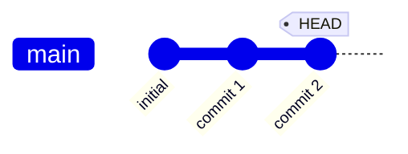
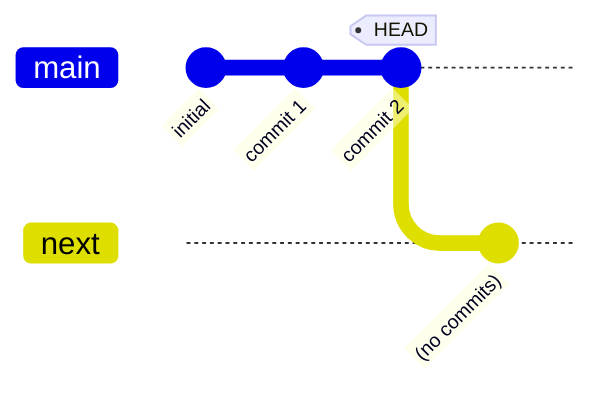

# bug #359: crash with symbolic reference branches

Reproduces https://github.com/gitext-rs/git-stack/issues/359.
git-stack panics with `unwrap()` on `None` when the repo contains
a symbolic ref branch (created via `git symbolic-ref`).

```scenario
SETUP
INIT
commit 1 times message "commit 1"
commit 1 times message "commit 2"
DONE
```

<details>
<summary>After SETUP</summary>



</details>

```scenario
IT "handles symbolic ref branches without crashing"
git symbolic-ref refs/heads/next refs/heads/main
try stack
# Panics give exit code -1 (signal); a fixed version should give 0
EXPECT exit-code 0
```

<details>
<summary>After "handles symbolic ref branches without crashing" (FAILED)</summary>



```console
$ exit code: -1
thread 'main' (2003811) panicked at src/legacy/git/repo.rs:559:40:
called `Option::unwrap()` on a `None` value
stack backtrace:
   0: __rustc::rust_begin_unwind
             at /rustc/842bd5be253e17831e318fdbd9d01d716557cc75/library/std/src/panicking.rs:689:5
   1: core::panicking::panic_fmt
             at /rustc/842bd5be253e17831e318fdbd9d01d716557cc75/library/core/src/panicking.rs:80:14
   2: core::panicking::panic
             at /rustc/842bd5be253e17831e318fdbd9d01d716557cc75/library/core/src/panicking.rs:150:5
   3: core::option::unwrap_failed
             at /rustc/842bd5be253e17831e318fdbd9d01d716557cc75/library/core/src/option.rs:2193:5
   4: <core::option::Option<git2::oid::Oid>>::unwrap
             at ~/.rustup/toolchains/nightly-aarch64-apple-darwin/lib/rustlib/src/rust/library/core/src/option.rs:1016:21
   5: <git_stack::legacy::git::repo::GitRepo>::load_local_branch
             at ~/oss/git-stack/src/legacy/git/repo.rs:559:40
   6: <git_stack::legacy::git::repo::GitRepo>::local_branches::{closure#0}
             at ~/oss/git-stack/src/legacy/git/repo.rs:528:22
   7: <&mut <git_stack::legacy::git::repo::GitRepo>::local_branches::{closure#0} as core::ops::function::FnMut<(core::result::Result<(git2::branch::Branch, git2::BranchType), git2::error::Error>,)>>::call_mut
             at ~/.rustup/toolchains/nightly-aarch64-apple-darwin/lib/rustlib/src/rust/library/core/src/ops/function.rs:298:21
   8: core::iter::traits::iterator::Iterator::find_map::check::<core::result::Result<(git2::branch::Branch, git2::BranchType), git2::error::Error>, git_stack::legacy::git::repo::Branch, &mut <git_stack::legacy::git::repo::GitRepo>::local_branches::{closure#0}>::{closure#0}
             at ~/.rustup/toolchains/nightly-aarch64-apple-darwin/lib/rustlib/src/rust/library/core/src/iter/traits/iterator.rs:2933:32
   9: <&mut core::iter::traits::iterator::Iterator::find_map::check<core::result::Result<(git2::branch::Branch, git2::BranchType), git2::error::Error>, git_stack::legacy::git::repo::Branch, &mut <git_stack::legacy::git::repo::GitRepo>::local_branches::{closure#0}>::{closure#0} as core::ops::function::FnMut<((), core::result::Result<(git2::branch::Branch, git2::BranchType), git2::error::Error>)>>::call_mut
             at ~/.rustup/toolchains/nightly-aarch64-apple-darwin/lib/rustlib/src/rust/library/core/src/ops/function.rs:298:21
  10: <git2::branch::Branches as core::iter::traits::iterator::Iterator>::try_fold::<(), &mut core::iter::traits::iterator::Iterator::find_map::check<core::result::Result<(git2::branch::Branch, git2::BranchType), git2::error::Error>, git_stack::legacy::git::repo::Branch, &mut <git_stack::legacy::git::repo::GitRepo>::local_branches::{closure#0}>::{closure#0}, core::ops::control_flow::ControlFlow<git_stack::legacy::git::repo::Branch>>
             at ~/.rustup/toolchains/nightly-aarch64-apple-darwin/lib/rustlib/src/rust/library/core/src/iter/traits/iterator.rs:2434:21
  11: <core::iter::adapters::flatten::FlattenCompat<_, _> as core::iter::traits::iterator::Iterator>::try_fold::flatten::<git2::branch::Branches, (), core::ops::control_flow::ControlFlow<git_stack::legacy::git::repo::Branch>, core::iter::traits::iterator::Iterator::find_map::check<core::result::Result<(git2::branch::Branch, git2::BranchType), git2::error::Error>, git_stack::legacy::git::repo::Branch, &mut <git_stack::legacy::git::repo::GitRepo>::local_branches::{closure#0}>::{closure#0}>::{closure#0}
             at ~/.rustup/toolchains/nightly-aarch64-apple-darwin/lib/rustlib/src/rust/library/core/src/iter/adapters/flatten.rs:563:35
  12: <core::iter::adapters::flatten::FlattenCompat<core::result::IntoIter<git2::branch::Branches>, git2::branch::Branches>>::iter_try_fold::<(), <core::iter::adapters::flatten::FlattenCompat<_, _> as core::iter::traits::iterator::Iterator>::try_fold::flatten<git2::branch::Branches, (), core::ops::control_flow::ControlFlow<git_stack::legacy::git::repo::Branch>, core::iter::traits::iterator::Iterator::find_map::check<core::result::Result<(git2::branch::Branch, git2::BranchType), git2::error::Error>, git_stack::legacy::git::repo::Branch, &mut <git_stack::legacy::git::repo::GitRepo>::local_branches::{closure#0}>::{closure#0}>::{closure#0}, core::ops::control_flow::ControlFlow<git_stack::legacy::git::repo::Branch>>
             at ~/.rustup/toolchains/nightly-aarch64-apple-darwin/lib/rustlib/src/rust/library/core/src/iter/adapters/flatten.rs:424:19
  13: <core::iter::adapters::flatten::FlattenCompat<core::result::IntoIter<git2::branch::Branches>, git2::branch::Branches> as core::iter::traits::iterator::Iterator>::try_fold::<(), core::iter::traits::iterator::Iterator::find_map::check<core::result::Result<(git2::branch::Branch, git2::BranchType), git2::error::Error>, git_stack::legacy::git::repo::Branch, &mut <git_stack::legacy::git::repo::GitRepo>::local_branches::{closure#0}>::{closure#0}, core::ops::control_flow::ControlFlow<git_stack::legacy::git::repo::Branch>>
             at ~/.rustup/toolchains/nightly-aarch64-apple-darwin/lib/rustlib/src/rust/library/core/src/iter/adapters/flatten.rs:566:14
  14: <core::iter::adapters::flatten::Flatten<core::result::IntoIter<git2::branch::Branches>> as core::iter::traits::iterator::Iterator>::try_fold::<(), core::iter::traits::iterator::Iterator::find_map::check<core::result::Result<(git2::branch::Branch, git2::BranchType), git2::error::Error>, git_stack::legacy::git::repo::Branch, &mut <git_stack::legacy::git::repo::GitRepo>::local_branches::{closure#0}>::{closure#0}, core::ops::control_flow::ControlFlow<git_stack::legacy::git::repo::Branch>>
             at ~/.rustup/toolchains/nightly-aarch64-apple-darwin/lib/rustlib/src/rust/library/core/src/iter/adapters/flatten.rs:241:20
  15: <core::iter::adapters::flatten::Flatten<core::result::IntoIter<git2::branch::Branches>> as core::iter::traits::iterator::Iterator>::find_map::<git_stack::legacy::git::repo::Branch, &mut <git_stack::legacy::git::repo::GitRepo>::local_branches::{closure#0}>
             at ~/.rustup/toolchains/nightly-aarch64-apple-darwin/lib/rustlib/src/rust/library/core/src/iter/traits/iterator.rs:2939:14
  16: <core::iter::adapters::filter_map::FilterMap<core::iter::adapters::flatten::Flatten<core::result::IntoIter<git2::branch::Branches>>, <git_stack::legacy::git::repo::GitRepo>::local_branches::{closure#0}> as core::iter::traits::iterator::Iterator>::next
             at ~/.rustup/toolchains/nightly-aarch64-apple-darwin/lib/rustlib/src/rust/library/core/src/iter/adapters/filter_map.rs:64:19
  17: <git_stack::stack::State>::new
             at ~/oss/git-stack/src/bin/git-stack/stack.rs:110:23
  18: git_stack::stack::stack
             at ~/oss/git-stack/src/bin/git-stack/stack.rs:316:21
note: Some details are omitted, run with `RUST_BACKTRACE=full` for a verbose backtrace.
```

</details>
