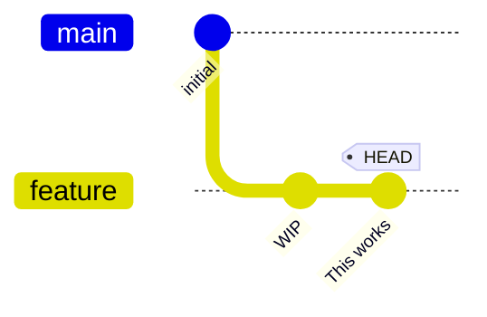

# bug #37: WIP status hidden for non-tip commits

Reproduces https://github.com/gitext-rs/git-stack/issues/37.
If a WIP commit is not the tip of its branch, the branch's
display should still reflect the WIP status.

```scenario
SETUP
INIT
create feature
commit 1 times message "WIP"
commit 1 times message "This works"
DONE
```

<details>
<summary>After SETUP</summary>



</details>

```scenario
IT "shows WIP status for non-tip commits"
stack
EXPECT output contains "WIP"
```
