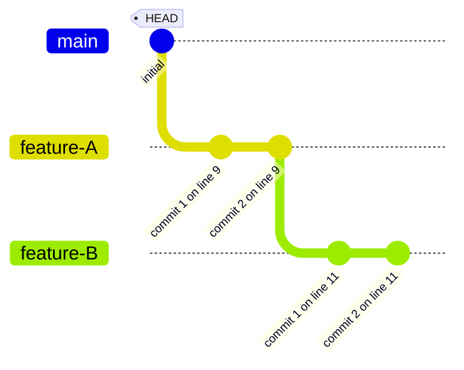
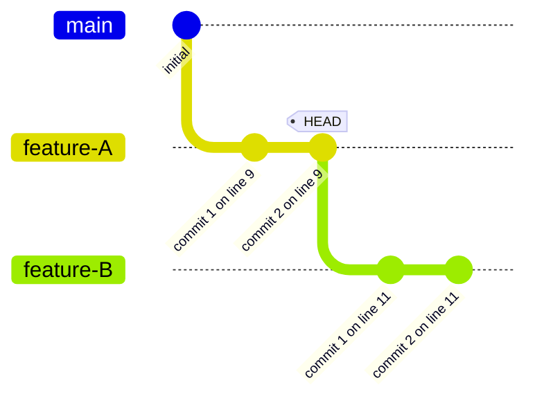

# navigate: next and prev across a stack

Verify that `git next` and `git prev` navigate through branches in a stack.

```scenario
SETUP
INIT
create feature-A
commit 2 times
create feature-B
commit 2 times
checkout main
DONE
```

<details>
<summary>After SETUP</summary>



</details>

```scenario
IT "next --branch moves to the first child branch"
next --branch
EXPECT on branch feature-A
```

<details>
<summary>After "next --branch moves to the first child branch"</summary>



</details>

```scenario
IT "prev --branch from feature-B returns to feature-A"
checkout feature-B
prev --branch
EXPECT on branch feature-A
```

<details>
<summary>After "prev --branch from feature-B returns to feature-A"</summary>


</details>

```scenario
IT "next then prev is a round trip"
next --branch
EXPECT on branch feature-A
next --branch
EXPECT on branch feature-B
prev --branch
EXPECT on branch feature-A
prev --branch
EXPECT on branch main
```
