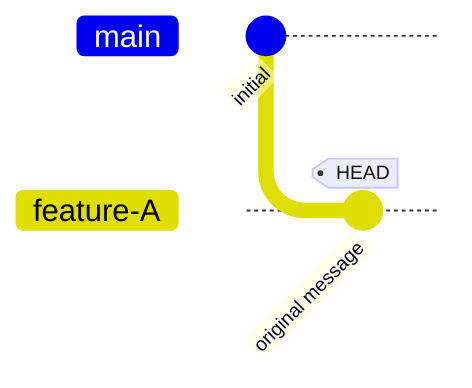
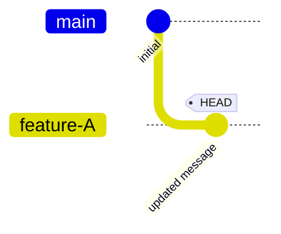

# reword: change a commit message

Verify that `git reword` rewrites the HEAD commit message.

```scenario
SETUP
INIT
create feature-A
commit 1 times message "original message"
DONE
```

<details>
<summary>After SETUP</summary>



</details>

```scenario
IT "rewrites the HEAD commit message"
reword --message "updated message"
EXPECT commit-message "updated message"
EXPECT on branch feature-A
EXPECT clean
```

<details>
<summary>After "rewrites the HEAD commit message"</summary>



</details>
