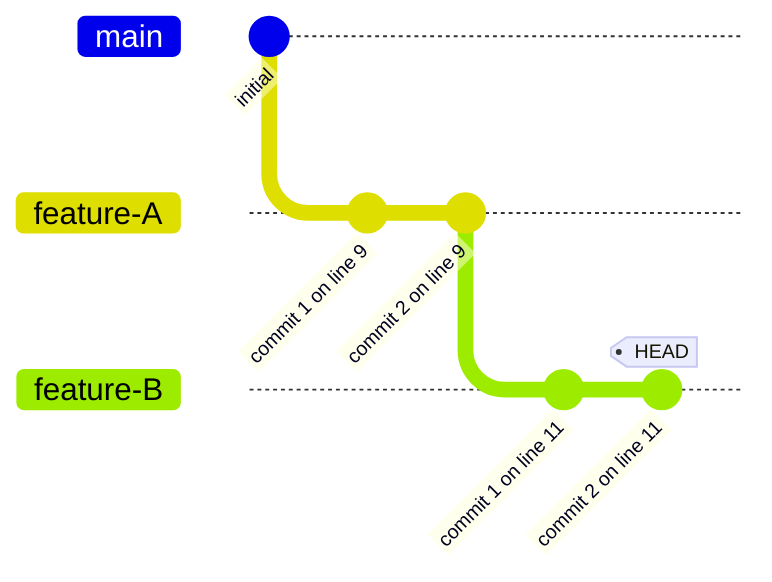
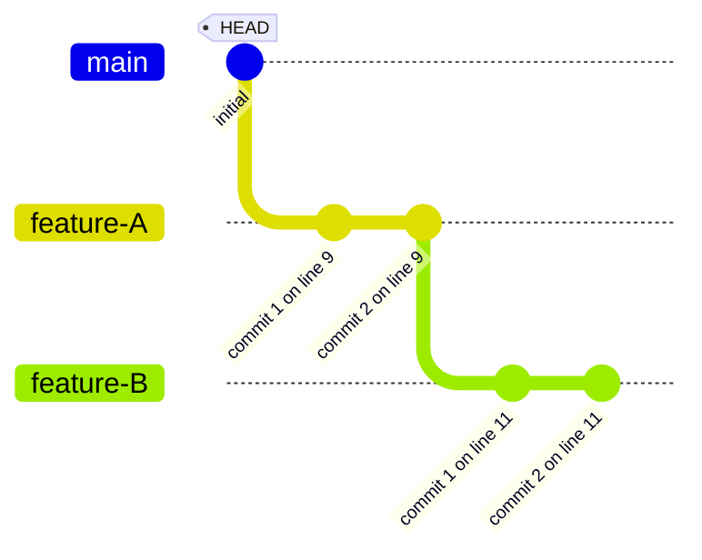

# stack: basic branch visualization

Verify that `git stack` displays a linear stack of branches correctly.

```scenario
SETUP
INIT
create feature-A
commit 2 times
create feature-B
commit 2 times
DONE
```

<details>
<summary>After SETUP</summary>



</details>

```scenario
IT "shows branches on the stack"
checkout main
stack
EXPECT on branch main
EXPECT exists feature-A
EXPECT exists feature-B
EXPECT branch-count 3
```

<details>
<summary>After "shows branches on the stack"</summary>



</details>

```scenario
IT "feature-A is an ancestor of feature-B"
EXPECT ancestor main feature-A
EXPECT ancestor feature-A feature-B
EXPECT ancestor main feature-B
```

```scenario
IT "ends on the last created branch"
EXPECT on branch feature-B
EXPECT clean
```
